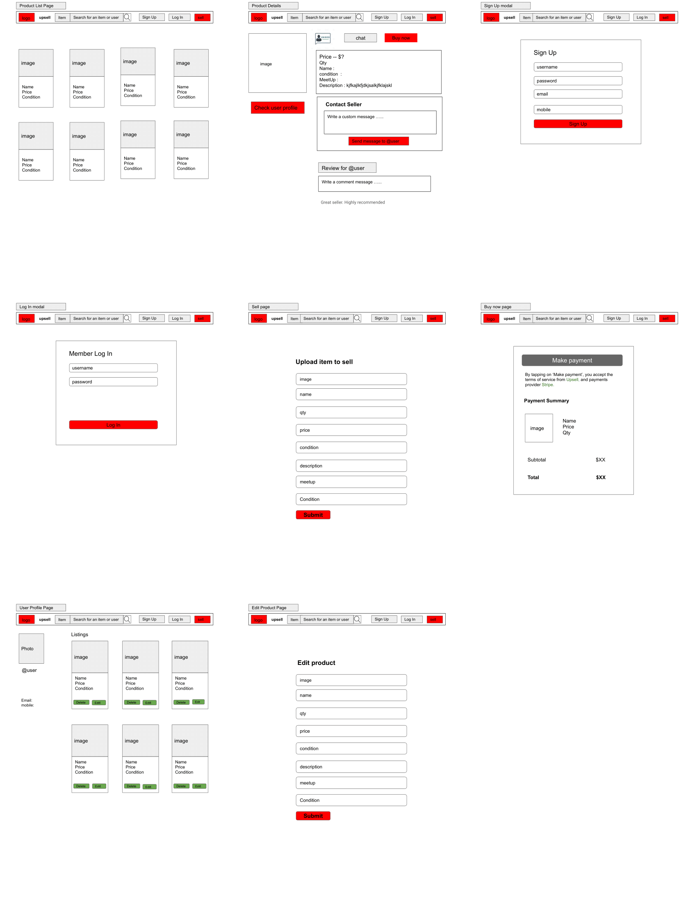

## Table of contents
* Project Title
* Project Demo
* Project Motivation
* Technologies
* Wireframes
* Project scope and implementation
* Challenges
* Improvements

## Project Title : Upsell - an online e-commerce website
developed by Helen, Shi Jie & Danny


## Project Demo
* https://upsell-frontend.herokuapp.com
* https://github.com/siewkhee1990/upsell-backend
* https://github.com/siewkhee1990/upsell-frontend


## Project motivation
Upsell is a web-based consumer to consumer and business to consumer marketplace for buying and selling new and secondhand goods.


## Technologies
* Node.js,
* Express
* React.js
  - React Router Dom
  - React Context API
* User authentication
   - passport.js
   - JasonWebToken 
* MongoDB
* Mongoose
* Bootstrap
* CSS

## Wireframes




## Project scope and implementation :

The architecture of our application is based on MVC and Microservices model. They are:

* Client Tier (Front-end/View)
It was written in Javascript, HTML and CSS using ReactJS as the framework. User will interact with the server by accessing the features of our application.

* The Business Logic Tier (Back-end/Controller)
It was written using NodeJS and ExpressJS, and this tier represents the Application Server that will act as a bridge of communication for the Client Tier and Database Tier. This tier will serve JSX pages to the user's device and accept HTTP requests from the user and follow with the appropriate response.

* Database Tier (Model)
MongoDB is used to store all of the crucial data our application needs to function.


This project contains 3 parts:

1) Build a good structured SERVER App with NodeJS/ExpressJS/MongoDB and
   to implement user authentication with PassportJS and JSONWebToken (JWT).
2) Build a ReactJS app and integrate it with the SERVER.
3) Heroku Deployment

Project structure

```
project
 └── upsell-backend (server)
   └── controller   — Storing APIs (GET, POST, PUT, DELETE)
      |__ listings.js/orders.js/user.js
   |__ db
    ├── index.js

   └── database
    ├── model       — store all the models of the project
    └── schema      — create attribute for each model
   ├── routes
   └── Server.js    — Everything a server needs to start

  └── upsell-frontend (client)
     └── Public  
        |__ index.html
     ├── components - store all the react components
     └── hocs
          |__ PrivateRoute.js
     └── services  - store all the API calls  
     ├── App.js
     └── App.css
     |__ AuthContext.js - centralized users' information
     |__ context.js - centralized listings' information
     |__ index.js
```


## Challenges
* CORS configuration that prevent cookies set in the client's browser.  
* use herokuapp.com that does not allow cookies 
* Integration of 3 parties codes 

## Improvements
* to implement live chat, review & comment panel and other payment methods.
* to implement social media authentication. 
* to implement forgot password and email verification.
* explore how to use cloudinary 

